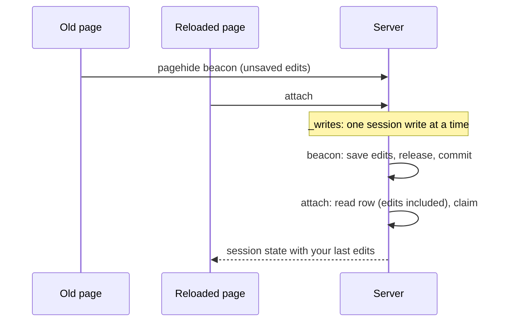

# Sessions

A **session** is one browser tab's working state: the page you are on and its
URL, the connection and database you are querying, your workspace, and the
per-view settings a reload should bring back. It lives in SQLite, so it survives
a browser refresh *and* a backend restart.

One tab holds a session at a time, but sessions outlive the tabs that held them:
close a tab and the next one you open picks its session back up.

> **`sessionStorage` holds identity. The server holds state.** The app uses no
> `localStorage` at all.

## What a session remembers

| | |
| --- | --- |
| Route and URL | `/explorer?table=events`, `/dashboard?name=sales` |
| Connection | the connection this session is on, and its selected database |
| Workspace | which workspace scopes its queries, dashboards and git sync |
| Query panel | SQL text, page size, visible columns, sort |
| Queries | the script text |
| Explorer | the Tables sidebar width |

**Results are not remembered** — a reload restores the SQL you were writing,
never the rows, so reopening a tab cannot re-fire an expensive query. Neither is
the page you were on: an offset is a cursor into a result set that no longer
exists, and restoring one would point a fresh query at nothing. The explorer is
the exception only because it is URL-driven — a restored `?table=` re-loads that
table exactly as following the link would.

Transient state is never written: open popovers, filter text, a drag in
progress, fetched rows.

## Refresh, new tabs, and the claim

What you get:

- **Refresh** → the same session, same page, same everything.
- **New tab while another is open** → a new session; the first tab holds its own.
- **New tab with nothing else open** → your last session comes back.

Each tab keeps `qv_tab` (a token it mints) and `qv_session` (what it is attached
to) in `sessionStorage`. Both survive a refresh, neither crosses to a new tab —
so **a tab that already has an id is refreshing, a tab without one is new.**

A session is **held** while its tab has been heard from within 90 seconds. Tabs
re-attach every 10 seconds, which doubles as the heartbeat, and beacon a release
when they close; a crashed tab simply stops heartbeating and frees its session.
The TTL is well past a minute because browsers throttle a hidden tab's timers
to about one run a minute.

`POST /api/sessions/attach` decides in one server-side pass, so two tabs opening
at once cannot race: the id the tab already has if it is free or already this
tab's, else the most recently active unheld session, else a new one. The first
case falls through when a *different* live tab holds that id — duplicating a tab
copies its `sessionStorage`, and the copy must not hijack the original.

A running tab is never moved silently. A sleeping laptop or a frozen tab can
still let a claim lapse and another tab take its session. Its next heartbeat (sent
with `keep`, see [api.md](./api.md)) gets a `409`: the tab greys out and stops
writing until you pick **Use it here** (the other tab then greys out) or **New
session**. Any session change re-syncs the whole shell.

The row is also the truth for the connection and its database. Every row the tab
adopts is checked against the connection it shows, so a switch made elsewhere
(another tab, an API caller) reaches it within a beat, and every view follows —
the explorer reloads its tables, the dashboard and the query panel re-run what
is on screen.

## The session dropdown

The top-right dropdown lists every session, most recently active first. A
session held by another live tab is shown but not selectable: two tabs on one
session would overwrite each other's state.

- **New session** starts a fresh one in this tab.
- **Rename this session** pins a name; clearing it unpins.
- **×** deletes a session; a session a live tab holds (this one included) has none.

An unpinned label is `Session <n>`, with `n` a stable ordinal, so a name never
changes under you when you switch databases. Each row shows the session's
connection and database beside its name.

Sessions never expire, so the list grows until you prune it — the cost of
sessions being durable and nameable rather than a capped history.

## Sessions and the agent

The id in the agent popover **is** the session id, and an agent pointed at it
acts on that session's connection, database and workspace, read straight from
the row. Arming is still the gate: disarming closes the channel and later pushes
fail with `unknown or inactive session`. Unlike the old per-arm id this one is
stable, so the command you copy stops changing under you. See
[remote.md](./remote.md).

## How it is stored

One row per session in SQLite (`sessions`), alongside connections and workspaces
— see [connect.md](./connect.md#storage--migrations).

```sql
id              TEXT PRIMARY KEY  -- also the agent channel id
seq             INTEGER           -- stable ordinal behind "Session 3"
label           TEXT              -- NULL = Session <n>; set = pinned by you
connection_name TEXT              -- NULL is the durable "disconnected" state
database        TEXT
workspace       TEXT
url             TEXT              -- path + query string
ui              TEXT              -- JSON, namespaced by view
claimed_by      TEXT              -- the tab token holding it
claim_seen_at   INTEGER           -- unix ms; stale after 90s
last_active_at  INTEGER           -- unix ms
```

`ui` is a blob rather than columns for the same reason a connection's config is:
a view can remember a new setting without a migration.

```json
{"query": {"sql": "…", "limit": 100, "visibleCols": [], "orderBy": []},
 "sql": {"sql": "…"},
 "explorer": {"sidebarWidth": 256}}
```

Every `/api/*` request names its session with an `X-QV-Session` header. There is
no session cookie — a session is named by its id, not by the browser it is open
in, which is what lets two tabs sit on two different databases. The one
exception is the remote-control SSE stream, which takes `?session=` because
`EventSource` cannot send headers.

**Nothing is written while you are still typing.** Leaving the query panel is
what "done editing" means, so that is when its state is written — the same
focus-out signal the [edit lock](./remote.md) uses, so both agree on when you
have finished. Discrete acts (a navigation, a workspace switch, a rename) write
at once.

Everything else rides two backstops: `pagehide` beacons whatever is still
pending, covering a reload, a close or a navigation away, and a 5s idle timer,
so a tab that dies mid-edit loses at most what was typed since its last pause.
The explorer's sidebar width has no focus to leave, so it is written by those
alone.

Writes are fire-and-forget — the page never waits on one, and a lost patch costs
a remembered preference, never your work in the live tab.

**A reload keeps what you typed just before it.** A reload sends the server two
requests for the same session, milliseconds apart: the old page's `pagehide`
beacon with its unsaved edits, then the new page's `attach`, which reads the
session back. If `attach` read the row before the beacon's write was committed,
the page would come back without those last edits. Session writes therefore run
one at a time (the `_writes` lock in `sessions.py`), so `attach` waits for the
beacon:



The `/api/sessions/*` shapes are in [api.md](./api.md). Connection and database
are not among them — `/api/db/connect`, `/open` and `/database` write those
through, so connection changes keep one path.
